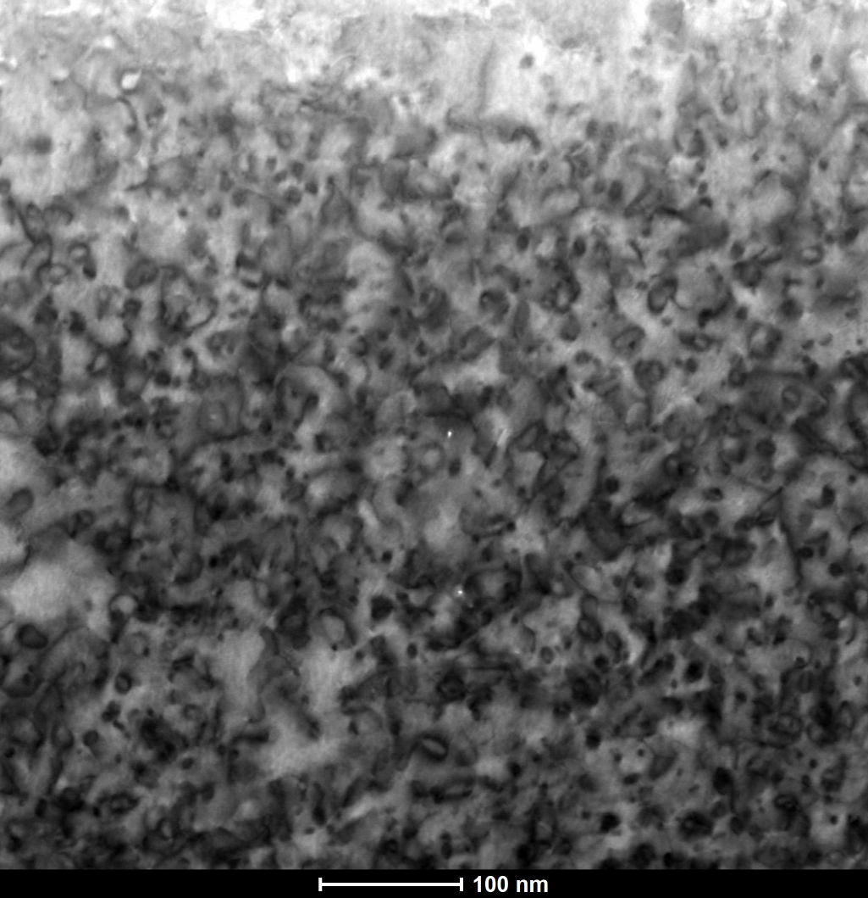
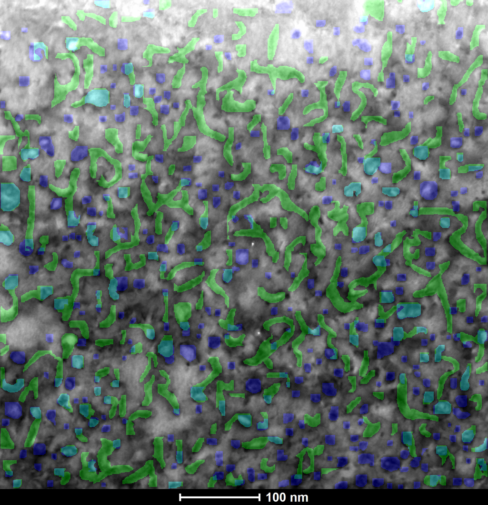
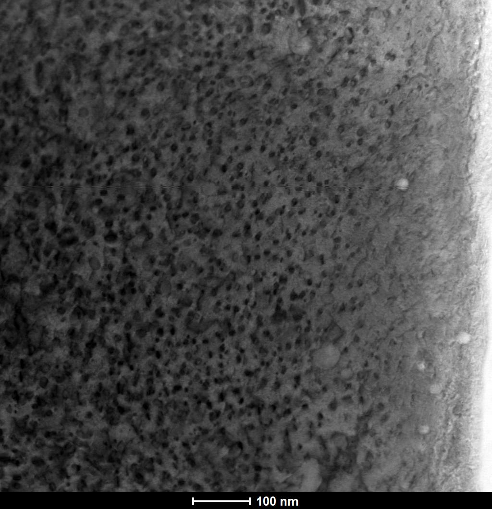
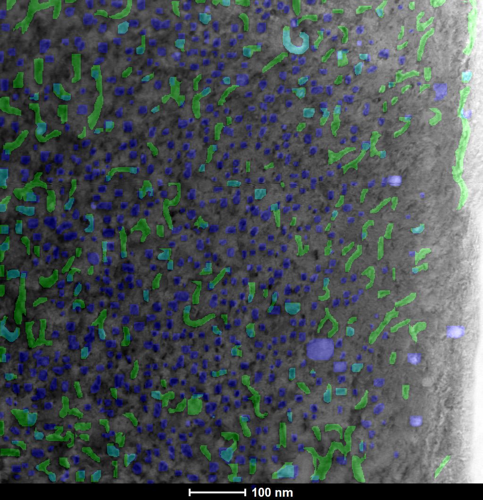
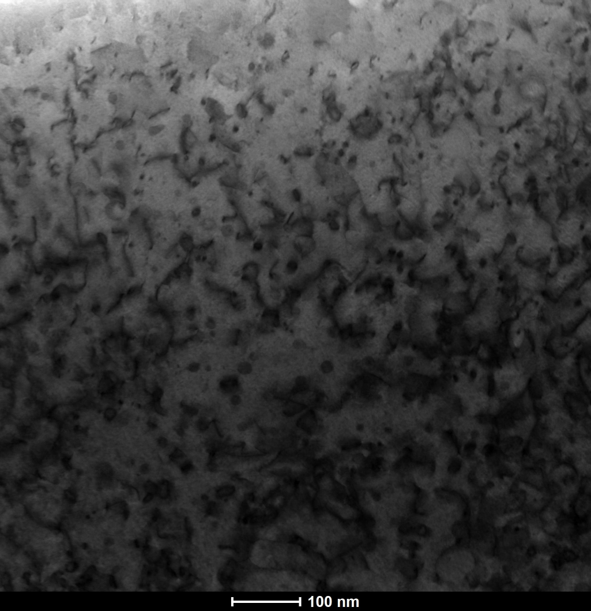
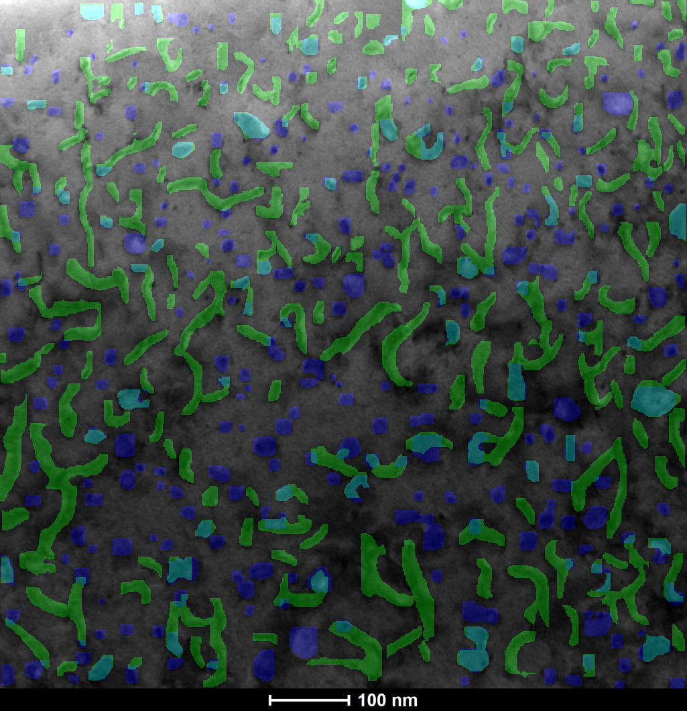
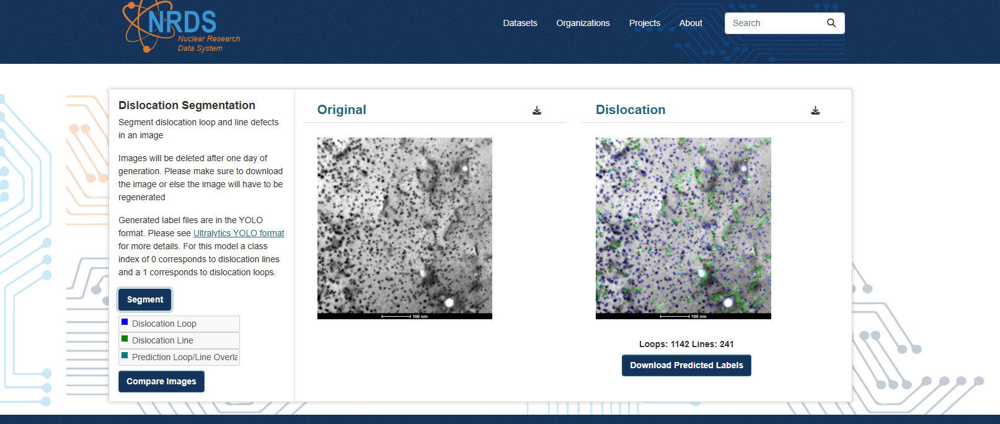

> [!WARNING]
> **This repository has been archived and is no longer maintained.**
> The code is provided for historical reference and may contain unpatched
> or unknown vulnerabilities. It should not be used in production systems.

---

# Authors

- **Michael Wu**  
  Contact: [michael.wu@inl.gov](mailto:michael.wu@inl.gov)

- **Jeremy Sharapov**  
  Contact: [jeremy.sharapov@inl.gov](mailto:jeremy.sharapov@inl.gov)

- **Matthew W. Anderson**  
  Contact: [matthew.anderson2@inl.gov](mailto:matthew.anderson2@inl.gov)

## PANDA 🐼: Predictive Automation of Novel Defect Anomalies

The quantitative analysis of dislocation-type defects in irradiated materials is critical to materials characterization in the nuclear energy industry. The conventional approach of an instrument scientist manually identifying any dislocation defects is both time-consuming and subjective, thereby potentially introducing inconsistencies in the quantification.

This work approaches dislocation-type defect identification and segmentation using a standard open source computer vision model, YOLO11, that leverages topic-adjacent transfer learning to create a highly effective dislocation defect quantification tool while using only a minimal number of annotated micrographs for training. This model demonstrates the ability to segment both dislocation lines and loops concurrently in micrographs with high pixel noise levels and on two alloys not represented in the training set.

Inference of dislocation defects using transmission electron microscopy on three different irradiated alloys relevant to the nuclear energy industry are examined in this work with widely varying pixel noise levels and with completely unrelated composition and dislocation formations for practical post irradiation examination analysis.

## Cite PANDA
`Wu, M., Sharapov, J., Anderson, M. et al. Quantifying dislocation-type defects in post irradiation examination via transfer learning. Sci Rep 15, 15889 (2025). https://doi.org/10.1038/s41598-025-00238-5`

## Example PANDA Predictions
### Prediction Key

- **Blue**: `Loops`
- **Green**: `Lines`
- **Teal**: `Loop and Line Overlap`

| Example 1 | Example 2 | Example 3 |
|---------------------------------|---------------------------------|---------------------------------|
| 
  
 | 
  
 | 
  
 |
| 
Predicted Lines: `617`, Predicted Loops: `482` <a href="https://nrds.inl.gov/dataset/transmission_electron_microscopy_of_ion_irradiated_ods_ma956_samples/resource/127ed661-7c79-4360-be41-2d6282d67dbb">Example Image 1</a> <a href="./read_me_img/txt_labels/img_1_label.txt">Download TXT Labels</a>
 | 
Predicted Lines: `514`, Predicted Loops: `989` <a href="https://nrds.inl.gov/dataset/transmission_electron_microscopy_of_ion_irradiated_ods_ma956_samples/resource/e0970d42-5c18-496f-860f-0fbd3d324a80">Example Image 2</a> <a href="./read_me_img/txt_labels/img_2_label.txt">Download TXT Labels</a>
 | 
Predicted Lines: `561`, Predicted Loops: `428` <a href="https://nrds.inl.gov/dataset/transmission_electron_microscopy_of_ion_irradiated_ods_ma956_samples/resource/64eb06c7-4dea-4b6b-8af6-bae94630fb67">Example Image 3</a> <a href="./read_me_img/txt_labels/img_3_label.txt">Download TXT Labels</a>
 |

## Current Papers Using PANDA: 
| Title | DOI |
|-------|-----|
 | `Quantifying dislocation-type defects in post irradiation examination via transfer learning`| https://doi.org/10.1038/s41598-025-00238-5 |
| `Microstructure of Neutron-Irradiated Al3Hf-Al Thermal Neutron Absorber Materials`|  https://doi.org/10.3390/ma18040833 |

## Try PANDA And Browse Datasets Online Via NRDS Website
The Nuclear Research Data Search (NRDS) site is a public-facing, long-term data storage solution and science data gateway featuring integrated compute resources such as artificial intelligence enabled hardware, and access to graphics processing units (GPUs). Operated out of the US Department of Energy Office of Nuclear Energy's Nuclear Science User Facilities (NSUF) program, NRDS takes publicly funded data from NSUF research and makes it accessible to the public without requiring a paywall or account and ensure all data meets the pFAIRe criteria.

| NRDS Website | Description |
|--------------|------------------|
| [Access the MA956 Database](https://nrds.inl.gov/dataset/transmission_electron_microscopy_of_ion_irradiated_ods_ma956_samples) | Select any image ending with **.jpg** file extension and navigate to bottom left and click **Dislocation Segmentation**. |
| [Try Out PANDA On An Example Image](https://nrds.inl.gov/dataset/transmission_electron_microscopy_of_ion_irradiated_ods_ma956_samples/resource/a2566c88-2c1b-42ae-8d61-667d379626f4) | Navigate to bottom left and click `Dislocation Segmentation`. Users have the option to **segment**, **download predictions**,**compare image**, and view **prediction frequency**.| 

## Example NRDS Interface

## License

Copyright 2024, Battelle Energy Alliance, LLC, ALL RIGHTS RESERVED

This program ("Program") utilizes YOLO11 under the [GNU Affero General Public License v3.0 (AGPL-3.0)](https://www.gnu.org/licenses/agpl-3.0.en.html#license-text). For more information about YOLO11, see the [official documentation](https://docs.ultralytics.com/models/yolo11/).

You should have received a copy of the GNU AGPL-3.0 license along with this Program. If not, you may find a copy of it at [https://www.gnu.org/licenses/agpl-3.0.en.html#license-text](https://www.gnu.org/licenses/agpl-3.0.en.html#license-text).

The YOLO11 is free software. You can redistribute it and/or modify it under the terms of GNU AGPL-3.0 as published by the Free Software Foundation, either version 3 of the License or (at your option) any later version.

The portion of the Program that is not YOLO11 is owned by Battelle Energy Alliance (BEA) (Copyright 2024 BEA). The source code or instruction sets for running this portion of the program, along with the source code for YOLO11, are made available to the user upon running the Program. This Program (including the YOLO11 portion and the BEA portion) is licensed to the user under AGPL-3.0 and can be used according to that license for so long as the user is in compliance with that license.
